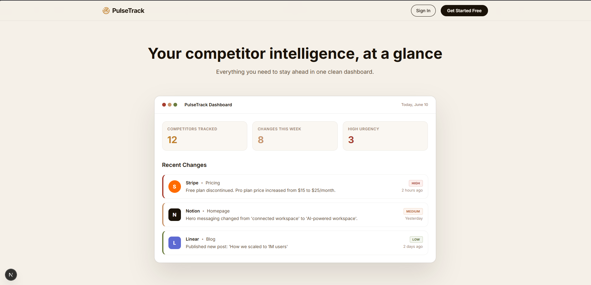

# PulseTrack

> **Your competitor intelligence, at a glance. Monitor competitors 24/7, detect changes, and use AI to understand what it means for your business.**

## 📸 Overview

<!-- ADD SCREENSHOT HERE -->
![PulseTrack Dashboard Placeholder]

## ✨ Features

- **Automated Scraping Pipeline:** Track competitor pricing, homepages, feature lists, and changelogs automatically using ScrapingBee.
- **AI-Powered Analysis:** Groq-powered AI instantly parses changes to explain what changed, why it matters, and how you should respond.
- **Intelligent Activity Feed:** High, Medium, and Low urgency alerts categorized automatically to prevent noise.
- **Visual Diff Viewer:** See the exact text additions and deletions across competitor website revisions.
- **Magic Link & Passwordless Auth:** Seamless NextAuth integration with Google and Resend.
- **Weekly Email Digests:** Automatically generated beautiful HTML reports summarizing competitor movements.

## 🛠 Tech Stack

| Category         | Technologies Used                                                                 |
| ---------------- | --------------------------------------------------------------------------------- |
| **Framework**    | Next.js 14 (App Router), React, TypeScript                                      |
| **Styling**      | Tailwind CSS, Framer Motion, GSAP, Radix UI (shadcn/ui)                         |
| **Database**     | PostgreSQL (Neon), Prisma ORM                                                     |
| **Auth**         | NextAuth.js (Magic Links via Resend, Google OAuth, Credentials)                   |
| **Background**   | Inngest (Cron jobs, async scraping queues)                                        |
| **AI & Scraping**| Groq (Llama 3 / Mixtral for analysis), ScrapingBee (Bypassing anti-bot)           |

## 🚀 Local Setup

1. **Clone the repository:**
   ```bash
   git clone https://github.com/prerna020/pulsetrack.git
   cd pulsetrack
   ```

2. **Install dependencies:**
   ```bash
   npm install
   ```

3. **Set up Environment Variables:**
   Copy the `.env.example` file to `.env` and fill in your keys:
   ```bash
   cp .env.example .env
   ```

4. **Sync the Database:**
   Push the Prisma schema to your Neon database and generate the client:
   ```bash
   npx prisma db push
   npx prisma generate
   ```

5. **Run the Development Server:**
   ```bash
   npm run dev
   ```
   Open [http://localhost:3000](http://localhost:3000) with your browser to see the result.

## 🏗 Architecture (Scraping Pipeline)

1. **Trigger:** Inngest cron job triggers the `scrape-all-competitors` function daily.
2. **Fetch:** ScrapingBee is used to fetch the raw HTML of the competitor's page, bypassing CAPTCHAs and proxies.
3. **Parse:** Cheerio extracts the human-readable text from the HTML, stripping out scripts and styles.
4. **Diff Detection:** The text is compared against the last known version using the `diff` library.
5. **AI Analysis:** If a significant diff is found, Groq AI analyzes the raw diff to determine the urgency and business impact.
6. **Notification:** The change is saved to the database and an email digest/dashboard alert is generated.

## ☁️ Deploy to Vercel

PulseTrack is optimized for Vercel. 

1. Push your code to a GitHub repository.
2. Import the project in Vercel.
3. Vercel will automatically detect **Next.js**. The build command `prisma generate && next build` is already configured in `package.json`.
4. Add all required Environment Variables (see below).
5. Click **Deploy**.

---
*Built with modern web standards to keep you one step ahead.*
